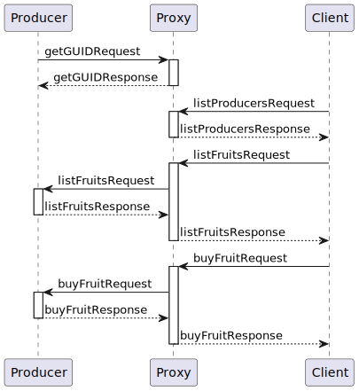

# A feladat kiírása

```
[soap producers] ----ssl ---> [soap proxy] ---- https ---> [3rd party clients(curl)]
```
 
A feladat hogy létre kell hozni:


1. Soap producer-t, mini soap kiszolgálót, ami
    1. induláskor ssl-el csatlakozik a soap proxy alkalmazáshoz és kér magának egy egyedi azonosítót, amit konzolra logolva meg is jelenít hogy egyszerűen beazonosítható legyen a teszteléshez.
    2. A megnyitott ssl csatornán várja a soap kéréseket, amit végrehajt majd a választ visszaküldi ugyanezen az ssl csatornán
2. Soap proxy alkalmazást, ami
    1. egy ssl server socketen várja, hogy az 1. pontban létrehozott alkalmazások csatlakozzanak hozzá, majd kérésre küld nekik egyedi azonosítót. Az egyedi azonosító uuid v4 formátumú és a soap producerek egyedi azonosításra szolgál, hogy a 3rd party kliensek ki tudják választani hogy melyik soap producert akarják a proxy alkalmazáson keresztül megszólítani.
    2. Lehetővé teszi hogy 3rd party kliensek https-el soap kéréseket küldjenek, ahol egyedi http fejlécben adják meg hogy melyik soap producernek szól a kérés
3. 3rd party client. Ezt nem kell létrehozni, csak a curl-t kell használni a fenti alkalmazás megszólítására
    1. Wsdl/xsd lekérdezés a kiválaszott soap producer-től a proxy alkalmazáson keresztül
    2. Kiválasztott soap producernek kérés küldési a proxy-n keresztül.

 
# Megvalósítás

Általában egy kiírás meghatározza a domain-t amivel foglakozik a projekt, ez 
most ennél általánosab megfogalmazás, így nekem kellett meghatározni ezt. Én – 
nem túl fantázia dúsan – azt választottam a producerek gyümölcsöt termesztenek, 
a proxy pedig egy piac, igy a kliens számára a következő műveletek adódnak:

1. Kik vannak a piacon? A kérés a paraméter nélköli `listProducersRequest`. 
Válaszként a `listProducersResponse`-ban egy guid listát kapunk.
2. Mit árul egy őstermelő? A kérés a paraméter nélköli `listFruitsRequest`. 
Válaszként a  `listFruitsResponse`-ban termények nevét és azok árát 
kapjuk egy listában.
3. Vásárolunk valamit. A kérés a `buyFruitRequest` egy termény nevét, és 
mennyiségét adhatjuk meg. A válasz megmondja hogy sikeres volt-e a vásárlás, 
illetve megkapjuk miből hányat, mennyiért veszünk.

A renszer folyamatábrája:



Az alkalmazást java 17 altt írtam.

# Fordítás és Telepítés

Telepíteni a `root` mappéban kiadott következő utasítással lehet:
```
mvn clean install
```

# Futtatás

Szintén a `root` mappában kel kiadni a következő utasításokat.

## Proxy

Először a proxit kel fiuttatni:

```
java -jar proxy\target\proxy-1.0-SNAPSHOT.jar
```

Ez két webes porot használ: http://localhost:8080, https://localhost:8433. 
Ezeken a /ws pathon lehet elérni a sopa szervert.

A wsdl a [https://localhost:8443/ws/farmer.wsdl](https://localhost:8443/ws/farmer.wsdl) linken érhető el.
A xsd a [https://localhost:8443/farmer/model/farmer.xsd](https://localhost:8443/farmer/model/farmer.xsd) linken.

Illetve a 9007 porton várja a bejövő ssl kapcsolatokat a proderektől.

## Producer

Megaszabható a `-granary.json` argumentummal, hogy mit termeljen, ebből 
készítettem két pélga json-t a producer mappába. A paraméter elhagyása, vagy 
hiva esetén default értéket vesz fel.

```sh
java -jar producer\target\producer-1.0-SNAPSHOT.jar
```
vagy
```sh
java -jar producer\target\producer-1.0-SNAPSHOT.jar -granary.json=producer\granary1.json
```
vagy
```sh
java -jar producer\target\producer-1.0-SNAPSHOT.jar -granary.json=producer\granary2.json
```

## Client

A client nevü mappába összegyüjtöttem néhány file-t, hogy könnyebb legyen a 
tesztelés.

(Amíg a java-s utasításoknál windowsos irányba ált a slesh „\” a curl esetén linuxos irányba áll „/”))

### Az aktív producerek listája

```sh
curl --header "content-type: text/xml" -d @client/1_listProducersRequest.xml https://localhost:8443/ws --cacert client/localhost.crt
```

A válasz (beautifier után)
```xml
<SOAP-ENV:Envelope xmlns:SOAP-ENV="http://schemas.xmlsoap.org/soap/envelope/">
  <SOAP-ENV:Header/>
  <SOAP-ENV:Body>
    <ns2:listProducersResponse xmlns:ns2="http://bbox.riean.hu/farmer/model">
      <ns2:producers>9b7ba40b-c129-4c2d-bdf0-a65d334df9b5</ns2:producers>
      <ns2:producers>9cc3c8c5-1ee1-493a-9b17-04a8865fdd24</ns2:producers>
      <ns2:producers>fae1cfc1-618f-4ff4-94f9-1d13723cb4a1</ns2:producers>
      <ns2:producers>04119f4f-ad81-4d3c-bb1a-caeb846be5e4</ns2:producers>
    </ns2:listProducersResponse>
  </SOAP-ENV:Body>
</SOAP-ENV:Envelope>
```

### Termékek listája

A producerek között a `X-Producer-GUID` headerrel lehet választani.

```sh
curl --header "content-type: text/xml" -H "X-Producer-GUID: 04119f4f-ad81-4d3c-bb1a-caeb846be5e4" -d @client/2_listFruitsRequest.xml https://localhost:8443/ws --cacert client/localhost.crt
```

És a válasz:
```xml
<SOAP-ENV:Envelope xmlns:SOAP-ENV="http://schemas.xmlsoap.org/soap/envelope/">
  <SOAP-ENV:Header/>
  <SOAP-ENV:Body>
    <ns2:listFruitsResponse xmlns:ns2="http://bbox.riean.hu/farmer/model">
      <ns2:fruit>
        <ns2:name>apple</ns2:name>
        <ns2:price>699</ns2:price>
      </ns2:fruit>
      <ns2:fruit>
        <ns2:name>banan</ns2:name>
        <ns2:price>395</ns2:price>
      </ns2:fruit>
      <ns2:fruit>
        <ns2:name>citron</ns2:name>
        <ns2:price>899</ns2:price>
      </ns2:fruit>
    </ns2:listFruitsResponse>
  </SOAP-ENV:Body>
</SOAP-ENV:Envelope>
```


### Vásárlás

```sh
curl --header "content-type: text/xml" -H "X-Producer-GUID: 04119f4f-ad81-4d3c-bb1a-caeb846be5e4" -d @client/3_buyFruitRequest.xml https://localhost:8443/ws --cacert client/localhost.crt
```

És a válasz:
```xml
<SOAP-ENV:Envelope xmlns:SOAP-ENV="http://schemas.xmlsoap.org/soap/envelope/">
  <SOAP-ENV:Header/>
  <SOAP-ENV:Body>
    <ns2:buyFruitResponse xmlns:ns2="http://bbox.riean.hu/farmer/model">
      <ns2:success>true</ns2:success>
      <ns2:name>apple</ns2:name>
      <ns2:quantity>10</ns2:quantity>
      <ns2:price>6990</ns2:price>
    </ns2:buyFruitResponse>
  </SOAP-ENV:Body>
</SOAP-ENV:Envelope>
```